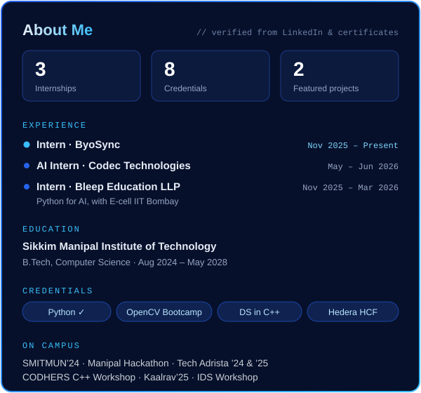

<div align="center">



<br/><br/>


</div>

<br/>

<div align="center">


</div>

<br/>

<div align="center">

## ⚡ Tech Stack

</div>

**Languages**


**AI / ML & Computer Vision**


**Problem Solving & Web3**


**Tools**


<br/>

<div align="center">

## 🚀 Featured Projects

</div>

<table>
<tr>
<td width="33%" valign="top">

### 🚗 Lane Detection & Steering Angle Prediction
Project-based learning at SMIT: detects lane boundaries from road imagery and predicts the matching steering angle, linking perception to control.

`Computer Vision` `Steering Prediction` `AI / ML`

📌 *Academic project (PBL)*

</td>
<td width="33%" valign="top">

### 📈 PredictaStock
An AI-powered platform for stock price forecasting that applies machine-learning ideas to historical market data.

`AI / ML` `Predictive Modeling` `Forecasting`

📌 *Personal project*

</td>
<td width="33%" valign="top">

### 💙 Personal Portfolio
A blue-themed personal site with internships, projects, a certificate gallery, and skills linked to proof.

`React` `TypeScript` `Tailwind CSS` `Framer Motion`

[🔗 Live Site](https://soumaditya-ghosh.antideploy.com) · [📂 GitHub Repo](https://github.com/soumadityaghosh1/portfolio)

</td>
</tr>
</table>

<br/>

<div align="center">

## 💼 Experience

</div>

| Role | Organisation | Period |
| :-- | :-- | :-- |
| **Intern** · Python, Python for AI | **ByoSync** | Nov 2025 – Present |
| **Artificial Intelligence Intern** · AICTE & ICAC approved | **Codec Technologies Pvt. Ltd.** | May 2026 – Jun 2026 |
| **Intern** · Python for AI, with E-cell IIT Bombay | **Bleep Education LLP** · Sikkim | Nov 2025 – Mar 2026 |
| **Internship** *(announced)* | **TP Central Odisha Distribution Limited (TPCODL)** | Jun 2026 |

<br/>

<div align="center">

## 🎓 Certifications

</div>

| Credential | Issuer | Date |
| :-- | :-- | :-- |
| Hedera Certified Foundation (HCF) | The Hashgraph Association | Aug 2026 |
| Data Structures in C++ | Log2Base2 | Apr 2026 |
| Python for AI — Training | Bleep Education × E-cell IIT Bombay | Dec 2025 – Apr 2026 |
| Python · [✅ verify](https://log2base2.com/Assets/Certificates/subendhughosh24/Python) | Log2Base2 | Sep 2025 |
| OpenCV Bootcamp | OpenCV University | — |
| SQL (Basic) | HackerRank | — |

<br/>

<div align="center">

## 📊 GitHub Analytics


<br/>


<br/><br/>

### 📈 Contribution Graph

<picture>
  <source media="(prefers-color-scheme: dark)" srcset="https://raw.githubusercontent.com/soumadityaghosh1/soumadityaghosh1/output/github-contribution-grid-snake-dark.svg" />
  <source media="(prefers-color-scheme: light)" srcset="https://raw.githubusercontent.com/soumadityaghosh1/soumadityaghosh1/output/github-contribution-grid-snake.svg" />
  
</picture>

</div>

<br/>

<table>
<tr>
<td width="33%" valign="top">

### 🏆 Journey Timeline
- **2024:** Joined SMIT, B.Tech CSE
- **2024:** SMITMUN’24 · CODHERS C++ Workshop · Tech Adrista ’24
- **2025:** Kaalrav’25 · Tech Adrista ’25 · Python certified
- **Nov 2025:** Internships at ByoSync & Bleep Education
- **2026:** Data Structures in C++ · AI Intern at Codec Technologies
- **Aug 2026:** Hedera Certified Foundation 🚀

</td>
<td width="33%" valign="top">

### 🗺️ Learning Roadmap
- ✅ **Python:** certified (Log2Base2)
- ✅ **Data Structures in C++:** certified
- ✅ **SQL:** HackerRank Basic
- 🔄 **Python for AI:** internships & training
- 🔄 **Computer Vision:** OpenCV
- 🔄 **DSA in Java:** LeetCode practice
- 🔄 **Web3:** Hedera foundations

</td>
<td width="33%" valign="top">

### 🎯 Current Focus

```python
while curious:
    learn()   # Python for AI, OpenCV, DSA
    build()   # vision & forecasting projects
    ship()
    repeat()

# Curious by default.
# Consistent by choice.
```

</td>
</tr>
</table>

<br/>

<div align="center">

## 🌐 Let's Connect

[](https://www.linkedin.com/in/soumaditya-ghosh-63474832b)
[](https://github.com/soumadityaghosh1)
[](mailto:soumadityaghosh92@gmail.com)
[](https://www.instagram.com/soumaditya_ghosh)
[](https://soumaditya-ghosh.antideploy.com)

**Open to internships, collaborations and hackathon teams. Let’s build something meaningful! 💡**


</div>
